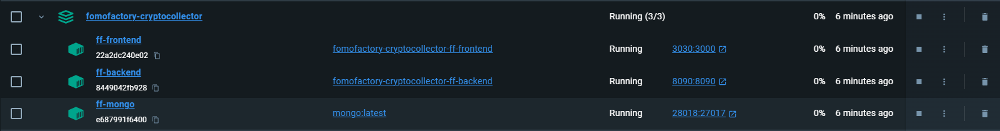

# FomoFactory-CryptoCollector

## Overview
This repository contains the code for a web app that streams live data of a limited set of cryptocurrencies.

## Installation

1. **Prerequisite: Docker Desktop**
   
    - The web app is packaged in Docker Compose as a multi-container application. To build and run on your local machine, download and install [Docker Desktop](https://www.docker.com/products/docker-desktop/)

3. **Source Code**
    
    - Clone the repository and get inside the root directory
      ```sh
      git clone https://github.com/its-just-pritam/postman-collection-exporter.git
      cd FomoFactory-CryptoCollector
      ```
    
    - Open a command line in the location and compose the YAML file
      ```sh
      docker compose up -d
      ```

4. **Build and Run**

   - The images take 5-10 minutes to build and go live.
   - Once all the 3 containers are live, you should be able to access them in Docker Desktop.
   - 
