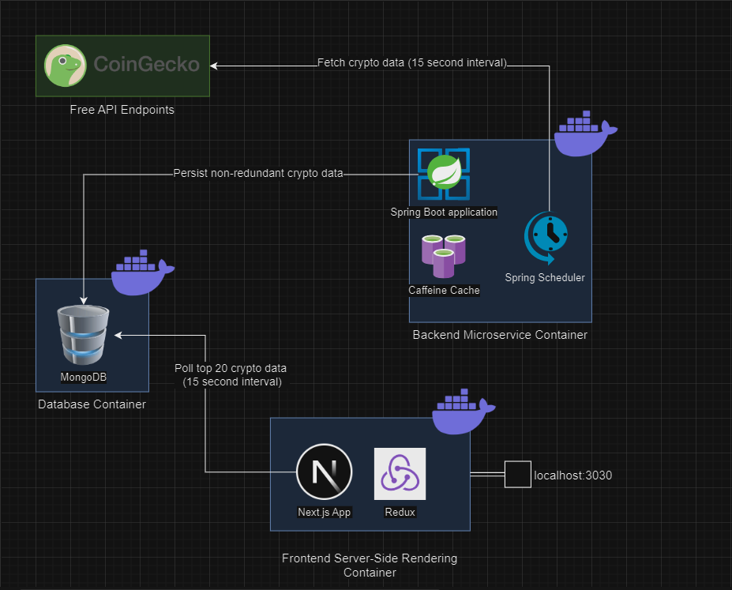
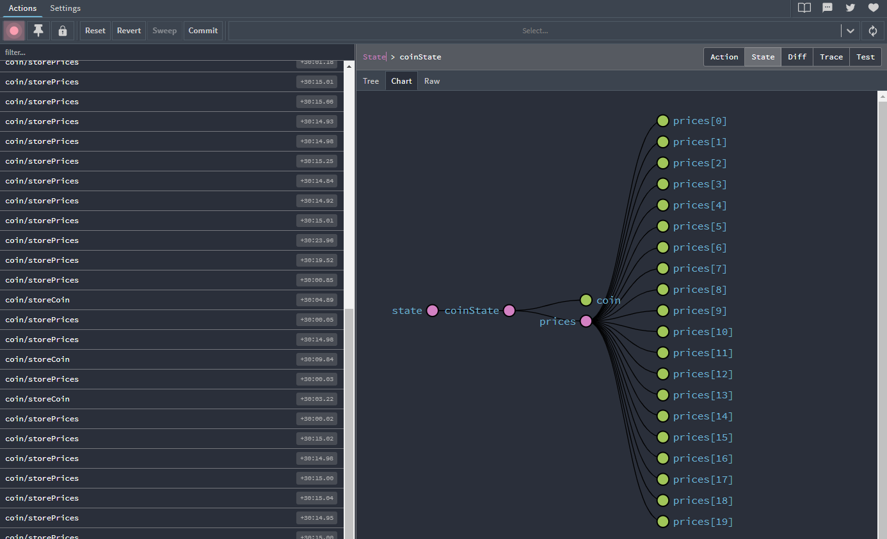
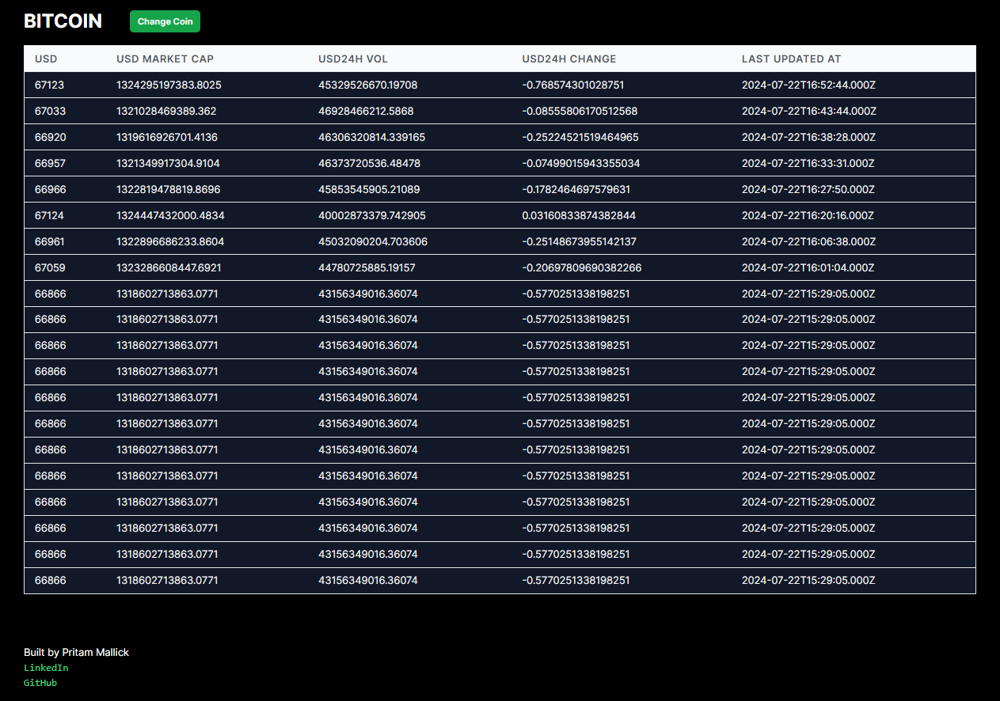
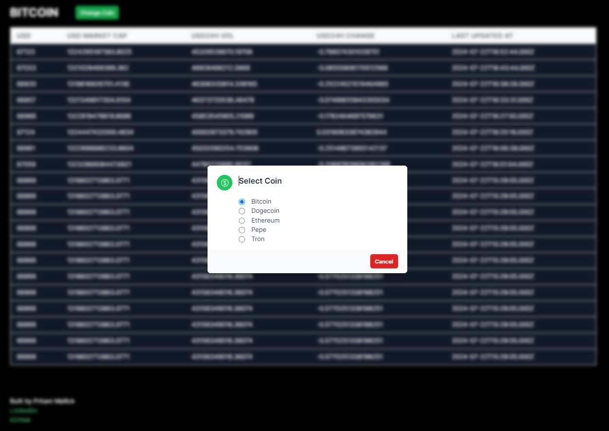

# FomoFactory-CryptoCollector

## Overview

   This repository contains the code for a web app that streams live data of a limited set of cryptocurrencies.


## Architecture



- The web app consists of 3 main servers running inside containers:

  - **Backend Microservice**:
    A Spring Boot application with **Spring Scheduler** fetches live cryptocurrency data from [CoinGeko](https://www.coingecko.com/) free API Endpoint every 15 seconds and pushes them to a database. Data duplication is avoided by usage of **Caffeine** in-memory cache to store last updated time of each cryptocurrency, which is compared agaist incoming polled data before pushing to databse.

  - **MongoDB**:
    Persists unstructured timeseries data dumped by the backend server.
    
  - **Frontend SSR App**: 
    A Next.js server with a single client side page which displays a table, listing top 20 prices with an oprion to change the stock price by polling the MongoDB server every 15 seconds. Local data is maintained via **Redux** store.

    


   

## Installation

1. **Prerequisite: Docker Desktop**
   
    - The web app is packaged in Docker Compose as a multi-container application. To build and run on your local machine, download and install [Docker Desktop](https://www.docker.com/products/docker-desktop/).

3. **Source Code**
    
    - Clone the repository and get inside the root directory
      
      ```sh
      git clone https://github.com/its-just-pritam/postman-collection-exporter.git
      cd FomoFactory-CryptoCollector
      ```
    
    - Open a command line in the location and compose the YAML file
      
      ```sh
      docker compose up -d
      ```

4. **Build and Run**

   - The images take 5-10 minutes to build and go live.
   - Once all the 3 containers are live, you should be able to access them in Docker Desktop.
     
     


## User Interface

Navigate to `http://localhost:3030` in your local web browser to access the UI.

    

## Issues

If you encounter any issues or have feature requests, please open an issue in the repository's [issue tracker](https://github.com/its-just-pritam/FomoFactory-CryptoCollector/issues).

## License

This project is licensed under the MIT License - see the [LICENSE](LICENSE) file for details.

## Acknowledgments

Thanks to the [CoinGeko](https://www.coingecko.com/) marketplace for their valuable resources and support.

---

Developed by [Pritam Mallick](https://github.com/its-just-pritam)
